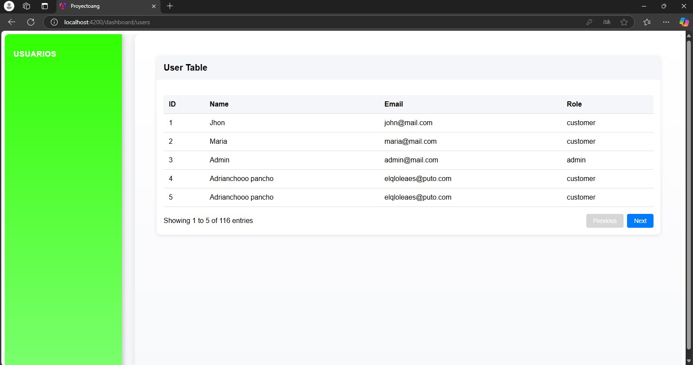

# Integracion de una API con Angular
Este proyecto de Angular 18.2 está diseñado para consumir una API de usuarios y mostrarlos en una tabla

## Caracteristicas
Se muestran los usuarios de la Api en una tabla
Consumo de API: Obtención de datos de usuario desde una API


## Link de la Api

#### Get all items

```https:
https//api.escuelajs.co/api/v1/users
```
## Dasboard con Usuarios


## Ejecucion de la aplicacion de manera local

Clona el repositorio

```bash
  https://github.com/Ferchox45/PrograWebLFCH.git
```

Vamos a la carpeta del proyecto

```bash
  cd PrograWebLFCH
```

Instalamos dependencias

```bash
  npm install
```

Corremos el servidor de manera loca

```bash
  ng serve
```
Abrimos la siguiente ruta en nuestro navegador para ver la tabla:

```bash
 http://localhost:4200/
```


## Licencia

